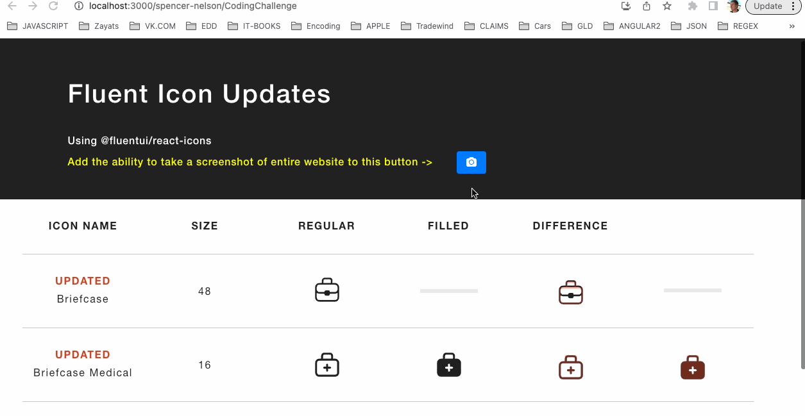

## Microsoft Coding Challenge

### Please have the candidate complete the following coding challenge ahead of the call.

- https://github.com/spencer-nelson/CodingChallenge

### The directions are as follows:

```
 Pull down the repo locally.
- Do what is needed to get the project up and running (you will need node and npm installed).
- Follow the instructions in the yellow text in the header area.
- Be prepared to screen share the running code and talk about all of the steps you took to complete the solution during our call.
```

### The solution gif-shot:


